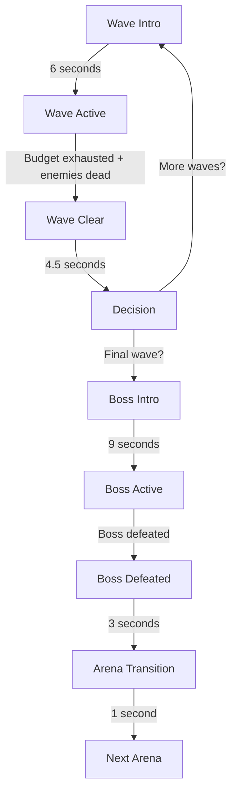

# Arena System Documentation

This document provides comprehensive reference for SPHERESTORM's arena system, including arena progression, wave mechanics, spawn systems, and implementation details.

## Table of Contents

- [Arena System Overview](#arena-system-overview)
- [Arena Roster](#arena-roster)
- [Wave System](#wave-system)
- [Wave Modifiers](#wave-modifiers)
- [Threat Budget System](#threat-budget-system)
- [Geometry & Features](#geometry--features)
- [Progression & Unlocks](#progression--unlocks)
- [Implementation Guide](#implementation-guide)

---

## Arena System Overview

SPHERESTORM uses a **progressive complexity system** where each arena introduces one new mechanic while building on previous skills. Arenas are the core structure of game progression.

### Core Concepts

**Progressive Teaching:**
- Arena 1: Movement fundamentals
- Arena 2: Cover and shields
- Arena 3: Verticality
- Arena 4: Multi-level combat
- Arena 5: Corridor control
- Arena 6: Synthesis of all mechanics

**Tiered Wave Counts:**
- Early arenas (1-2): Short, focused learning (3-5 waves)
- Mid arenas (3-4): Building complexity (6-8 waves)
- Late arenas (5-6): Full challenge (8-10 waves)

**Boss Culmination:**
- Each arena ends with a boss fight
- Boss tests the arena's taught mechanic
- Victory unlocks next arena

### Arena Structure

```
Arena Start
    ↓
Wave 1 (Lesson Wave) - Featured enemy intro
    ↓
Waves 2-N (Integration Waves) - Mixed threats
    ↓
Wave N (Exam Wave) - Harder preparation
    ↓
Boss Fight - Mechanic test
    ↓
Victory → Next Arena
```

---

## Arena Roster

### Arena 1: The Training Grounds

**Waves:** 3 (quick intro)

**Features:** Flat terrain, landmarks

**Color Theme:** Dark Blue-Gray (0x2a2a4a)

**Lore:** You are a new recruit learning the basics.

**Teaching Focus:** "Move, shoot, dodge - fundamentals under pressure"

**Boss Lesson:** Simple patterns teach timing and spacing

**Featured Enemy:** Red Puffer (only enemy type)

**Geometry:**
- Flat rectangular arena
- Corner landmarks for orientation
- No obstacles or cover
- Anti-edge spawn bias (discourages corner camping)
- Min distance from corner: 15 units

**Wave Breakdown:**
1. **Wave 1** (Lesson): Few Red Puffers, learn controls
2. **Wave 2** (Integration): More Red Puffers, test movement
3. **Wave 3** (Exam): Full pressure before boss

**Boss:** RED PUFFER KING
- Charge attacks
- Summons Fast Bouncers
- Shield mechanic introduction
- Tests pressure management

**Victory Unlocks:** Pillars & Cover mechanics

---

### Arena 2: Shields & Cover

**Waves:** 5

**Features:** Flat terrain, pillars (cover)

**Color Theme:** Blue-Gray (0x2a3a4a)

**Lore:** Shield-focused combat with tactical cover.

**Teaching Focus:** "Target priority, shield break mechanics, repositioning"

**Boss Lesson:** Cover is temporary advantage - keep moving

**Featured Enemy:** Shielded (70% spawn ratio)

**Geometry:**
- Asymmetric pillar layout (prevents "solved loops")
- Inner pillar count: 3 (odd number breaks rotational symmetry)
- Staggered cover placement (anti-camping)
- Corner pillars offset
- Pillars provide line-of-sight breaking

**Spawn Configuration:**
- Shielded ratio: 70% of wave spawns
- Forces shield break practice
- Anti-edge bias remains

**Wave Breakdown:**
1. **Wave 1** (Lesson): Introduce Shielded enemies
2. **Waves 2-4** (Integration): Mix Shielded + Red Puffers
3. **Wave 5** (Exam): High Shielded ratio, pre-boss pressure

**Boss:** THE MONOLITH
- Jump Slam attacks
- Hazard zone creation
- Pillar perch mechanic
- Tests cover vs. trap awareness

**Victory Unlocks:** Verticality, enemy jumping behavior

---

### Arena 3: Vertical Loop

**Waves:** 6

**Features:** Flat terrain, pillars, vertical elements, ramps

**Color Theme:** Purple-Gray (0x3a2a4a)

**Lore:** Elevation test - climb to engage enemies.

**Teaching Focus:** "Vertical awareness, climbing, repositioning under threat"

**Boss Lesson:** Teleportation and platform pressure

**Featured Enemy:** Pillar Police

**Geometry:**
- Tall pillars with accessible tops
- Ramps for vertical access
- Corner pillars have stepping stone access (CP4)
- Multi-height platforms
- Vertical loop opportunity

**Pillar Police Configuration:**
- Grace period: 1500ms (1.5s) after player lands
- Prevents instant punishment
- Corner access ramps provide escape routes

**Wave Breakdown:**
1. **Wave 1** (Lesson): Introduce Pillar Police
2. **Waves 2-5** (Integration): Mix vertical threats
3. **Wave 6** (Exam): Full vertical pressure

**Boss:** THE ASCENDANT
- Teleportation ability
- Prefers elevated platforms
- Spawns Teleporter minions
- Tests spatial awareness

**Victory Unlocks:** Platforms, multi-level enemy behavior

---

### Arena 4: Platform Gardens

**Waves:** 8

**Features:** Flat terrain, pillars, vertical, platforms, multi-level

**Color Theme:** Green-Gray (0x2a4a3a)

**Lore:** Multi-level combat arena with strategic vantage points.

**Teaching Focus:** "Movement planning, platform control, bouncer tracking"

**Boss Lesson:** Lane control foreshadowing tunnels

**Featured Enemy:** Fast Bouncer

**Geometry:**
- Multiple platform heights
- Bridges between platforms (min width: 5 units)
- Reset pads: 4 locations (return to ground)
- Height indicators for player orientation
- Complex vertical navigation

**Platform Configuration:**
- Bridge min width: 5 units (wide enough for safety)
- Reset pad count: 4 (accessible from most locations)
- Height indicators: Visual feedback system

**Wave Breakdown:**
1. **Wave 1** (Lesson): Introduce Fast Bouncers
2. **Waves 2-7** (Integration): Multi-level threats
3. **Wave 8** (Exam): Chaotic bouncer pressure

**Boss:** THE OVERGROWTH
- Growth mechanic
- Split at 25% HP
- Lane walls (tunnel preview)
- Spawns Water Balloons
- Tests space control

**Victory Unlocks:** Tunnels, ambush enemy behavior

---

### Arena 5: The Labyrinth

**Waves:** 8

**Features:** Flat terrain, pillars, vertical, platforms, tunnels

**Color Theme:** Red-Gray (0x4a2a3a)

**Lore:** Narrow corridors and chokepoints test your nerve.

**Teaching Focus:** "Priority targeting, corridor control, crowd management"

**Boss Lesson:** Burrow mechanics and hazard introduction

**Featured Enemy:** Splitter

**Geometry:**
- Narrow tunnels and corridors
- Chokepoint design
- Limited escape routes
- Ambush spawn points
- Claustrophobic pressure

**Tunnel Mechanics:**
- Reduce burst spawn chance by 50% (tunnels amplify unfairness)
- Force priority targeting
- Punish poor positioning

**Wave Breakdown:**
1. **Wave 1** (Lesson): Introduce Splitters
2. **Waves 2-7** (Integration): Tunnel pressure
3. **Wave 8** (Exam): Crowd control test

**Boss:** THE BURROWER
- Burrow/emerge mechanic
- Underground invulnerability
- Emerge warnings
- Tests reaction time

**Victory Unlocks:** Chaos Mode, hybrid arena mechanics

---

### Arena 6: Chaos Realm

**Waves:** 10 (longest arena)

**Features:** All previous features + hazards

**Color Theme:** Gray (0x3a3a3a)

**Lore:** Everything you learned converges here.

**Teaching Focus:** "Reaction, threat reading, adapting under layered pressure"

**Boss Lesson:** Pattern mastery, multi-mechanic synthesis

**Featured Enemy:** Teleporter

**Geometry:**
- Combines all previous arena features
- Flat areas, pillars, ramps, platforms, tunnels
- Hazard zones spawn during waves
- Maximum complexity

**Breather Waves:** 3, 6, 9
- Reduced cognitive load
- Recovery opportunity
- Breather music mode
- Lower enemy count/threat

**Wave Breakdown:**
1. **Wave 1** (Lesson): Introduce Teleporters
2. **Wave 2** (Integration): Building pressure
3. **Wave 3** (Breather): Recovery wave
4. **Waves 4-5** (Integration): Escalation
5. **Wave 6** (Breather): Recovery wave
6. **Waves 7-8** (Integration): High pressure
7. **Wave 9** (Breather): Final recovery
8. **Wave 10** (Exam): Maximum pressure before boss

**Boss:** CHAOS INCARNATE
- All 8 abilities
- Cyclic pattern system
- Color shifting
- Pattern mastery test
- Final examination

**Victory:** Game complete! (for current content)

---

## Wave System

### Wave Types

SPHERESTORM uses three wave types with different purposes:

#### Lesson Wave (Wave 1)
**Purpose:** Introduce arena's featured enemy

**Characteristics:**
- Lower threat budget
- Spawn interval: Slower (1500ms)
- Burst chance: Lower (0.1)
- Featured enemy guaranteed
- Cognitive max: Lower

**Teaching Goal:** Let player learn new mechanic safely

---

#### Integration Wave (Waves 2-N-1)
**Purpose:** Mix threats, build complexity

**Characteristics:**
- Medium threat budget
- Spawn interval: Variable (decreases with wave number)
  - Base: 1000ms
  - Reduces by 30ms per wave
  - Min: 700ms
- Burst chance: Variable (increases with wave number)
  - Base: 0.15
  - Increases by 0.02 per wave
  - Max: 0.25
- Mixed enemy types (up to cognitive limit)

**Scaling:** Difficulty increases each wave

---

#### Exam Wave (Final Wave)
**Purpose:** Prepare for boss, test learning

**Characteristics:**
- Higher threat budget
- Spawn interval: Fast (800ms)
- Burst chance: Higher (0.2)
- All available enemy types
- Full pressure

**Intensity:** Hardest wave before boss

---

### Wave Progression Flow



**Timing Constants (60 FPS):**
- Wave Intro: 360 frames (6 seconds)
- Wave Clear: 270 frames (4.5 seconds)
- Boss Intro: 540 frames (9 seconds)
- Boss Defeated: 180 frames (3 seconds)
- Arena Transition: 60 frames (1 second)

---

### Spawn Timing

**Base Intervals (milliseconds):**

| Wave Type | Interval | Notes |
|-----------|----------|-------|
| Lesson | 1500ms | Slow, safe learning |
| Integration | 1000-700ms | Decreases per wave |
| Exam | 800ms | Fast, intense |

**Burst Spawns:**
- Chance to spawn 2-4 enemies at once
- Increases pressure
- Wave number affects burst chance
- Arena 5 has 50% reduced burst (tunnels)

**Spawn Prevention:**
- Stress Pause: No spawns when 15+ enemies alive
- Micro-breathers: Every 10 spawns, 2-second pause
- Budget exhausted: Stop spawning

---

### Enemy Selection

**Process:**
1. Filter by arena availability
2. Apply cognitive type limit
3. Include featured enemy
4. Weight remaining enemies
5. Random weighted selection
6. Check budget affordability
7. Spawn enemy
8. Deduct budget cost

**Cognitive Type Limit:**

| Arena | Max Types |
|-------|-----------|
| 1 | 1 |
| 2 | 2 |
| 3 | 3 |
| 4+ | 4 |

**Featured Enemy:**
- Arena's `lessonEnemy` always in pool
- Guarantees lesson mechanic appearance

---

## Wave Modifiers

Wave modifiers alter spawn behavior and difficulty. Some are random, others are arena-specific.

### Breather

**Effect:** Reduced pressure, recovery wave

**Mechanics:**
- 0.6x threat budget multiplier
- Cognitive max: 8 (lower)
- No burst spawns
- Slower spawn interval (1.5x multiplier)

**Music:** Triggers breather music mode

**Usage:**
- Arena 6 waves 3, 6, 9
- Provides recovery in long arena

**Teaching Goal:** Pacing, prevent exhaustion

---

### Elite

**Effect:** Stronger enemies

**Mechanics:**
- 1.3x threat budget multiplier
- Spawns elite-only enemies (Shield Breaker)
- Higher stat enemies

**Teaching Goal:** Test skill with upgraded threats

---

### Rush

**Effect:** Fast spawning

**Mechanics:**
- 1.1x threat budget multiplier
- 0.7x spawn interval (30% faster)
- More enemies, less time between

**Teaching Goal:** Quick threat assessment

---

### Swarm

**Effect:** Many weak enemies

**Mechanics:**
- 1.2x threat budget multiplier
- Biased toward low-cost enemies
- High enemy count

**Teaching Goal:** Crowd control, area damage

---

### Harbingers

**Effect:** Preview next arena's enemies

**Mechanics:**
- 1.0x threat budget (normal)
- Forces next arena's enemy types
- Always triggers on final wave (if Arena 3+)

**Teaching Goal:** Preview upcoming mechanics

---

## Threat Budget System

### Budget Calculation

Each wave receives a threat budget:

```
Budget = Base Budget × Arena Scaling × Modifier Multiplier
```

**Base Budgets:**

| Wave Type | Total Budget | Max Cognitive |
|-----------|--------------|---------------|
| Lesson | 250 | 12 |
| Integration | 400 | 18 |
| Exam | 550 | 24 |

**Arena Scaling:**

| Arena | Multiplier |
|-------|------------|
| 1 | 0.7 |
| 2 | 0.9 |
| 3 | 1.0 |
| 4 | 1.1 |
| 5 | 1.2 |
| 6 | 1.3 |

**Example:**
```
Arena 3, Integration Wave, Elite Modifier
= 400 × 1.0 × 1.3
= 520 threat points
```

---

### Enemy Costs

Each enemy has a threat cost:

```
Cost = Durability Cost + Damage Cost
```

**Example Costs:**

| Enemy | Durability | Damage | Total | Notes |
|-------|------------|--------|-------|-------|
| Red Puffer | 10 | 8 | 18 | Cheap fodder |
| Shielded | 25 | 10 | 35 | High durability |
| Fast Bouncer | 12 | 10 | 22 | Speed threat |
| Splitter | 18 | 12 | 30 | Splits increase cost |
| Shooter | 8 | 12 | 20 | Ranged pressure |
| Teleporter | 15 | 12 | 27 | Mobility threat |

**Cognitive Cost:**
- Each enemy also has cognitive cost (1-3)
- Tracks visual complexity
- Prevents overwhelming readability

---

### Budget Exhaustion

Wave completes when:
1. Budget reaches 0 (no more spawns)
2. All enemies defeated
3. XP collected (optional, auto-collected)

**Failsafe:**
- If no affordable enemy exists, budget exhausted
- Prevents infinite spawn attempts
- Warning logged (once per wave)

---

## Geometry & Features

### Feature Types

#### Flat
- Base ground plane
- All arenas have this
- Starting point for navigation

#### Landmarks
- Visual orientation points
- Corner markers
- Help spatial awareness

#### Pillars
- Vertical obstacles
- Provide cover
- Break line of sight
- Can be climbed (Arena 3+)

#### Vertical
- Multi-height navigation
- Y-axis matters
- Fall damage (none in current build)

#### Ramps
- Sloped access to higher areas
- Smooth vertical transition
- Easier than jumping

#### Platforms
- Elevated flat surfaces
- Strategic positioning
- Multiple heights
- Bridges connect them

#### Tunnels
- Enclosed corridors
- Chokepoints
- Ambush opportunities
- Limited sight lines

#### Hazards
- Damage zones
- Environmental threats
- Persistent danger areas

---

### Anti-Camping Design

**Problem:** Players finding "safe spots"

**Solutions:**

1. **Asymmetric Geometry**
   - Breaks rotational patterns
   - No perfect kiting loops
   - Varied pillar placement

2. **Pillar Police (Arena 3)**
   - Punishes pillar camping
   - Forces constant movement
   - Patrols high ground

3. **Anti-Edge Spawn Bias**
   - Enemies don't spawn in corners
   - Min distance: 15 units from corner
   - Prevents corner camping

4. **Odd Pillar Counts**
   - 3 inner pillars (Arena 2)
   - Breaks symmetry
   - No "solved" routes

5. **Staggered Cover**
   - Offset pillar placement
   - Forces repositioning
   - No permanent safety

---

## Progression & Unlocks

### Mechanic Unlocks

Victory in each arena unlocks new mechanics:

| Arena | Unlocks | Description |
|-------|---------|-------------|
| 1 | Pillars & Cover | Arena 2 available |
| 2 | Verticality, Enemy Jumping | Enemies can now jump, Arena 3 available |
| 3 | Multi-Platform Combat | Complex vertical navigation, Arena 4 available |
| 4 | Tunnels & Ambushes | Corridor mechanics, Arena 5 available |
| 5 | Chaos Mode | All mechanics combined, Arena 6 available |
| 6 | - | Game complete (current content) |

### Enemy Unlocks

Enemies unlock progressively:

**Timeline:**
- Arena 1: Red Puffer
- Arena 2: + Shielded
- Arena 3: + Pillar Police
- Arena 4: + Fast Bouncer (Pillar Police removed)
- Arena 5: + Splitter
- Arena 6: + Teleporter (all enemies available)

**Special Cases:**
- Shooter: Boss minion only
- Water Balloon: Boss minion only
- Shield Breaker: Elite waves only

### Badge Unlocks

Each arena awards a persistent badge:

```javascript
{
    id: 'arena_N',
    name: 'Arena N Champion',
    description: 'Defeated [BOSS NAME]',
    persistent: true
}
```

**Benefits:**
- Visual progression marker
- Account persistence
- Roster unlock (see boss in roster)

---

## Implementation Guide

### Adding a New Arena

**1. Configuration (`js/config/arenas.js`):**

```javascript
export const ARENA_CONFIG = {
    arenas: {
        7: {
            name: 'The New Arena',
            waves: 8,
            features: ['flat', 'pillars', 'vertical', 'platforms', 'newFeature'],
            color: 0x4a2a3a,
            lore: 'Story description of the arena',
            teaches: 'What mechanic this arena teaches',
            bossLesson: 'What the boss tests',
            lessonEnemy: 'newEnemyType',
            
            // Optional configs
            shieldedRatio: 0.5,  // If shield focus
            breatherWaves: [4, 7],  // Recovery waves
            
            // Geometry configuration
            geometryConfig: {
                pillarSymmetry: 'asymmetric',
                coverBlockOffset: true,
                customProperty: true
            },
            
            // Spawn configuration
            spawnConfig: {
                antiEdgeBias: true,
                minDistFromCorner: 15
            }
        }
    }
};
```

**2. Geometry Generation (`js/arena/generator.js`):**

Add geometry generation:

```javascript
export function generateArena(arenaNumber) {
    // ... existing code
    
    if (arenaNumber === 7) {
        generateArena7Geometry();
    }
}

function generateArena7Geometry() {
    // Create ground plane
    // Add obstacles/features
    // Set spawn points
    // Configure lighting
}
```

**3. Boss Configuration (`js/config/bosses.js`):**

Add corresponding boss (Boss 7).

**4. Badge Configuration (`js/config/badges.js`):**

Add arena completion badge.

**5. Unlock Logic (`js/systems/waveSystem.js`):**

```javascript
function unlockArenaMechanics(defeatedArena) {
    // ... existing cases
    case 6:
        gameState.unlockedMechanics.newMechanic = true;
        unlockMessage = 'NEW MECHANIC UNLOCKED';
        break;
}
```

---

### Modifying Wave Counts

**To change wave count:**

Update `waves` property in `js/config/arenas.js`:

```javascript
2: {
    name: 'Shields & Cover',
    waves: 7,  // Changed from 5
    // ... rest of config
}
```

**Consider:**
- Longer arenas increase time investment
- Early arenas should stay short (fast loops)
- Late arenas can be longer (mastery test)

---

### Adding Wave Modifiers

**1. Define Modifier (`js/config/constants.js`):**

```javascript
export const WAVE_MODIFIERS = {
    newModifier: {
        name: 'New Modifier',
        announcement: 'MODIFIER ACTIVE!',
        budgetMult: 1.2,      // Threat budget multiplier
        intervalMult: 0.8,    // Spawn interval multiplier
        cognitiveMax: 15,     // Override cognitive limit
        forceTypes: ['enemy1', 'enemy2']  // Force specific enemies
    }
};
```

**2. Selection Logic (`js/systems/waveSystem.js`):**

```javascript
function selectWaveModifier(arena, wave, maxWaves, isLessonWave) {
    // Your selection logic
    if (specialCondition) {
        return 'newModifier';
    }
}
```

**3. Apply Effects:**

Modifier effects automatically applied in `handleWaveIntro()`.

---

### Adjusting Difficulty

**Threat Budget:**
- Increase base budgets in `THREAT_BUDGET.waveBudgets`
- Adjust arena scaling multipliers

**Spawn Rate:**
- Modify spawn intervals in `WAVE_CONFIG`
- Adjust burst chances

**Enemy Mix:**
- Change featured enemy in arena config
- Adjust spawn weights in enemy configs
- Modify cognitive type limits

**Breather Waves:**
- Add to `breatherWaves` array in arena config
- Reduces pressure at key points

---

## File References

**Configuration Files:**
- `js/config/arenas.js` - Arena definitions, wave counts, features
- `js/config/constants.js` - Wave states, threat budgets, modifiers
- `js/config/enemies.js` - Enemy availability per arena

**Implementation Files:**
- `js/arena/generator.js` - Arena geometry generation
- `js/systems/waveSystem.js` - Wave management, spawning, progression
- `js/core/gameState.js` - Arena state tracking

**Related Documentation:**
- `docs/BOSS.md` - Boss system (culmination of each arena)
- `docs/ENEMIES.md` - Enemy roster and progression
- `docs/PULSE_MUSIC_SYSTEM.md` - Arena-specific music profiles
